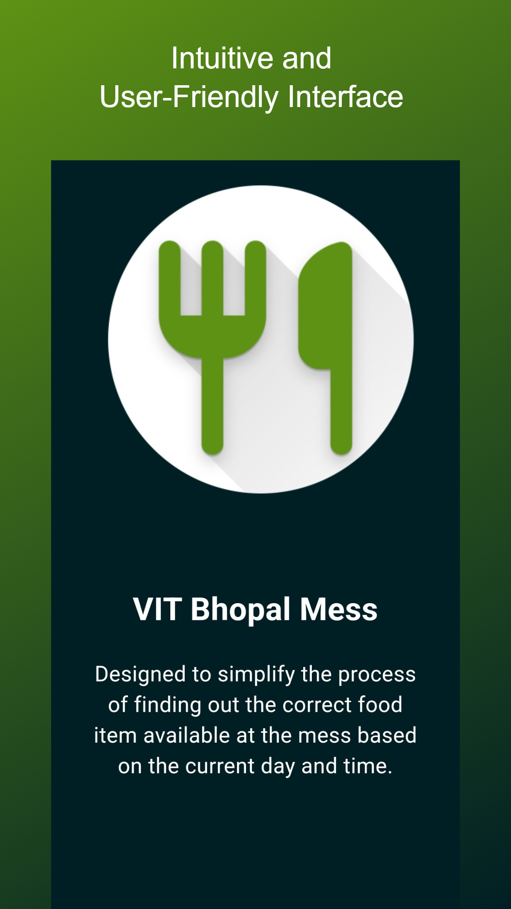
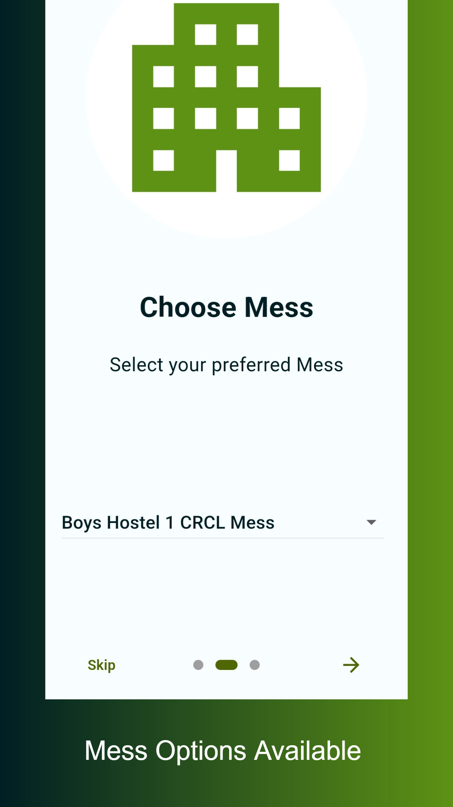
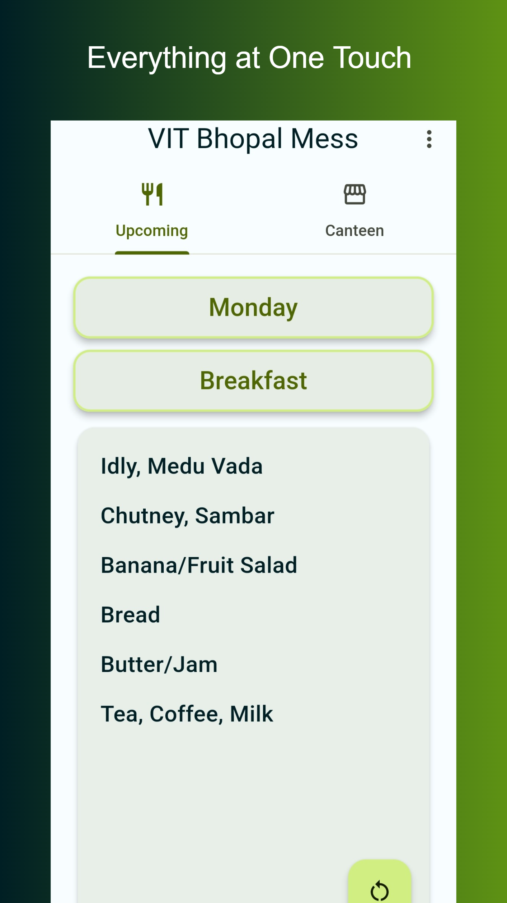
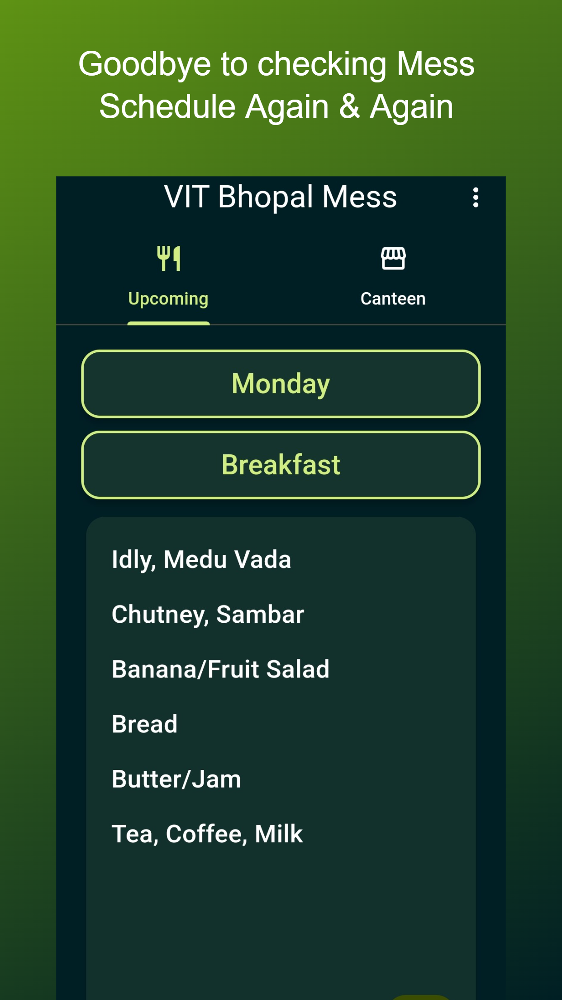
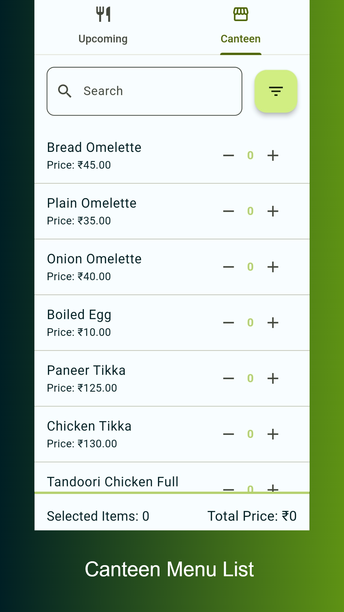
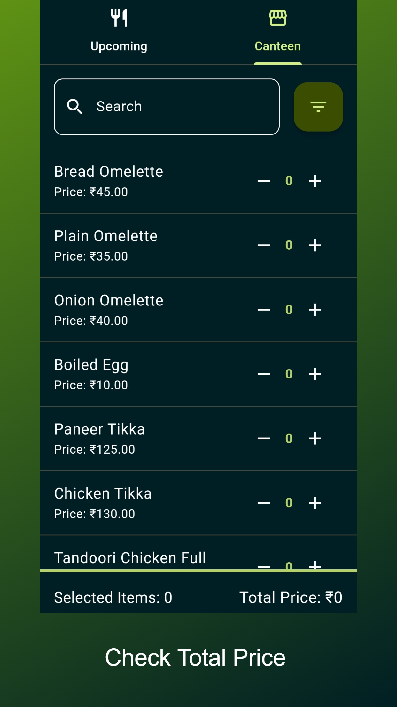

<a href='https://play.google.com/store/apps/details?id=com.shenmareparas.vit_mess&pcampaignid=pcampaignidMKT-Other-global-all-co-prtnr-py-PartBadge-Mar2515-1'></a>
 
# VIT Bhopal Mess
The "VIT Bhopal Mess" app 📱 & website 🌐 is designed to simplify the process of finding out the correct food item available at the mess 🍽️ based on the current day and time. It provides an intuitive and user-friendly interface for VIT Bhopal University students 👨‍🎓 to check the mess menu and make informed decisions about their meal choices 😋. It also provides the option to view the menu in the canteen and their respective prices 📋.

<a href='https://play.google.com/store/apps/details?id=com.shenmareparas.vit_mess&pcampaignid=pcampaignidMKT-Other-global-all-co-prtnr-py-PartBadge-Mar2515-1'></a>

## Features
- **Current Time Tracking:** The app automatically detects the current time and displays the food items available during that specific time slot.
- **User-Friendly Interface:** The user interface is designed to be intuitive and easy to navigate, allowing users to quickly find the information they need.
- **Search Functionality:** Users can search for specific Day or Meal time to get Food Items of it respectively.
- **Canteen:** Users can view, search as well as sort the menu and its prices available in the canteen, it can also see the total price of the selected items by adding or removing items from the cart, enabling them to make informed decisions about their food choices outside the mess.
- **Notifications:** The app will send push notifications to users to remind them about upcoming meals. (Coming Soon)

## Screenshots
<div>
  <div>
    
    
  </div>
  <div>
    
    
  </div>
  <div>
    
    
  </div>
  <div>
    
    
  </div>
</div>

## Technologies Used
- Flutter and Dart for building the mobile app & website
- Material UI 3 (Light Theme & Dark Theme)
- Shared Preferences
- Provider

## Installation
To run the "VIT Mess" app locally, follow these steps:
1. Ensure that you have Flutter installed on your machine. If not, refer to the official Flutter documentation for installation instructions.
2. Clone the repository to your local machine.

```bash
https://github.com/shenmareparas/VIT_Bhopal_Mess.git
```
3. Install the dependencies for the app.
```bash
flutter pub get
```
4. Start the app.
```bash
flutter run
```
5. Open the VIT Mess app on your emulator or device.

## Contribution
Contributions to the VIT Mess app are welcome and encouraged! If you would like to contribute, please follow these steps:

1. Fork the repository.
2. Create a new branch for your feature or bug fix.
3. Make your changes and ensure that the code compiles without any errors.
4. Write tests for your changes to maintain code quality.
5. Submit a pull request with a clear description of your changes and their benefits.

## Contact
If you have any questions, suggestions, or feedback, please feel free to contact me at shenmareparas@gmail.com or create an issue in the repository. I'd love to hear from you!

## Special Thanks
<a href = "https://github.com/addi1402"> @addi1402 </a>

## Privacy Policy
https://www.termsfeed.com/live/f3a9fb52-9e8b-45e3-a0a4-16901f7da9c4

## Enjoy using VIT Mess App!📱
We hope you find it helpful in determining the correct food item available at the mess. Enjoy your meal! 🍽️
